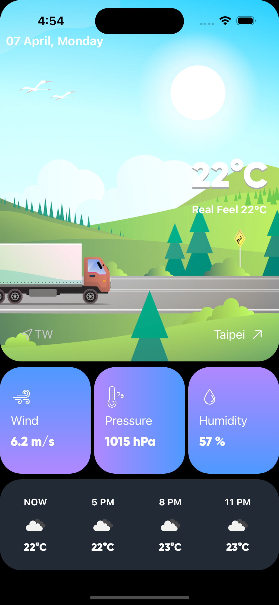
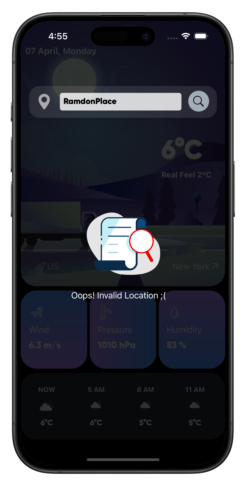

# WeatherApp

串接 OpenWeather 的 Weather API 顯示目前選擇的城市天氣資訊

  
  &nbsp
  
  &nbsp
  

- 顯示目前與預測幾小時內的天氣狀況  
- 可輸入英文城市名查詢  
- 顯示項目包括：
  - 氣溫  
  - 氣候狀況  
  - 風速  
  - 大氣壓力  
  - 濕度  
- 背景圖片依白天/夜晚切換顯示

---

**App Description:**

An app to observe weather status through specific areas.  
Only available for English.  
Please input English city name to search weather information.

---

**WebService APIs:**  
🔗 [OpenWeather API](https://openweathermap.org/api)

**UI Interface Reference:**  
🎨 [Dribbble Weather UI](https://dribbble.com/shots/20331883-Concept-Weather)

